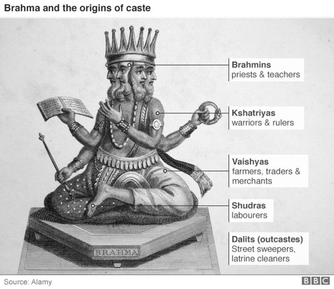

```{r setup, include=FALSE, warning=FALSE}
knitr::opts_chunk$set(echo = TRUE)
library(readr)
library(dplyr)
library(forcats)
library(stringr)
library(ggplot2)
library(forcats)
library(pander)
library(knitr)
library(ggthemes)
library(gridExtra)

setwd("~/Documents/Fall 2016/Data Sc/Final_Project")

# Load marriage preferences dataset
preferences_raw <- read_csv("Marriage_Preferences.csv") %>% 
  tibble::rownames_to_column(var="id")
```

---
output: 
  html_document: 
    keep_md: yes
---


* Name: Trisha Singh
* Project title: Caste-Based Mate Selection in Modern India
* RPubs link: <http://rpubs.com/tsingh/final_project>

**Abstract**: I examine how the prevalence of the caste system in India varies with socio-economic status. Specifically, I answer the question: “When seeking a marriage partner, is the importance given to the partner’s caste related to a person’s income, education or occupation?”

I find strong statistically significant relationships between socioeconomic status and attitude towards the caste system. Every $1000 increase in annual income is correlated with a 0.3 percent decrease in probability of having a preference for partner's caste. Additionally, I find that a person with a Master’s degree is 7.5 percentage points less likely and a person with a Professional degree is  15 percentage points less likely to have caste preferences than someone with a Bachelor’s degree. A person working in the public sector is 9 percentage points more likely to give importance to parnter's caste than a person working in the private sector.


## Introduction and Background



The caste system is a hierachical social structure that originated from Hindu scriptures in Ancient India. It classifies people into five main cateogories based on their occupations: _brahmins_ (priests and teachers), _kshatriyas_ (warriors and rulers), _vaishyas_ (farmers, traders and merchants), _shudras_ (labourers) and _dalits_ (street sweepers and latrine cleaners) (BBC 2016). Despite increased social mobility , the caste system is still prevalent and a person's caste can often be inferred from their family name. 

The class structure formed by the caste system has led to oppression of people belonging to lower rungs of the hierarchy (Center for Human Rights and Global Justice 2007). This oppression forms the basis of caste-based discrimination such wage and employment discrimination in modern India (Banerjee and Knight 1985). The rigidity of the caste system is further propagated through traditional rules such as living with members of the same caste, marrying within caste and so on.

Within-caste marriages are still strongly encouraged in the traditional marriage system (Banerjee et al. 2013). In the modern arranged marriage system, individuals place advertisements in local newspapers or create profiles on online matrimonial websites to search for marriage partners. Partner's caste is one of the major criteria for marriage and a person's caste preferences for their partner reveals their attitude towards the caste system.

I explore how the rigidity of caste preferences for marriage depends on a person’s income, education or occupation. Using a unique dataset of young middle class Indian men who placed matrimonial advertisements online, I predict a person's caste preferences based on their socio-economic status.

## Sample Summary

I use a dataset containing a random sample of 1,246 young middle class Indian men who placed advertisements for a marriage partner on a popular Indian matrimonial website. This dataset contains information about each person and their partner preferences such as income, education, caste, city and so on. 

I consider Hindu men as the caste system only exists in Hinduism. Figure 1 shows that my dataset contains people who have above average income, the mean income of the sample being $13,010 per annum. The sample also has a younger age distribution, with the mean age being 30 years. Since these are matrimonial advertisements placed online, my sample contains people who have access to computers or other devices and are digitally literate.

```{r, echo=FALSE, message=FALSE, warning=FALSE}
# CLEANING

preferences <- preferences_raw %>% 
  
  # Creating caste and sub caste binary variables
  mutate(partner_caste = ifelse(Caste == "\n Any Caste \n" |
                                  grepl("Caste no bar", Caste)==TRUE |
                                  Caste == "\n None \n" |
                                  Caste == "n/a", 0, 1)) %>% 
  mutate(partner_subcaste = ifelse(`Sub Caste` == "\n Any Sub Caste \n" |
                                     `Sub Caste` == "\n None \n" |
                                     `Sub Caste` == "n/a", 0, 1)) %>% 
  
  # Remove weird case (1 obs)
  filter(!(partner_caste==0 & partner_subcaste==1)) %>% 
  
  # must be hindu for caste/ subcaste to apply
  filter(Religion=="\n Hindu") %>%  
  
  # Cleaning income variable: only keeping income denoted in Rs
  filter(grepl("Rs", `Annual Income`)==TRUE) %>%
  mutate(mult_factor = ifelse(grepl("lakh", `Annual Income`)==TRUE, 100000, 
                              ifelse(grepl("crore", `Annual Income`)== TRUE, 10000000, 1))) %>% 
  mutate(income = str_sub(`Annual Income`, 8, 1000000)) %>% 
  mutate(income = str_replace_all(income, " lakhs", "")) %>% 
  mutate(income = str_replace_all(income, " crores", "")) %>% 
  mutate(income = str_replace_all(income, ",", "")) %>% 
  mutate(income = as.numeric(income)*mult_factor) %>% 
  mutate(income_dollar = income*0.015) %>% 
  
  # Cleaning education variable: Bachelor's, Masters, Professional, PhD
  mutate(education = fct_recode(Education, 
                                "Bachelor's" = "\n B.A.",
                                "Professional" = "\n Aeronautical Engineering",
                                "Professional" = "\n Aviation Degree",
                                "Bachelor's" = "\n B.A.M.S.",
                                "Bachelor's" = "\n B.Arch",
                                "Bachelor's" = "\n B.Com.",
                                "Bachelor's" = "\n B.Ed.",
                                "Bachelor's" = "\n B.L.",
                                "Bachelor's" = "\n B.M.M.",
                                "Bachelor's" = "\n B.Sc IT/ Computer Science",
                                "Bachelor's" = "\n B.Sc.",
                                "Bachelor's" = "\n B.Sc. Nursing",
                                "Bachelor's" = "\n B.Tech.",
                                "Bachelor's" = "\n BBA",
                                "Bachelor's" = "\n BCA",
                                "Bachelor's" = "\n BDS",
                                "Bachelor's" = "\n BE",
                                "Bachelor's" = "\n BFA",
                                "Bachelor's" = "\n BFM (Financial Management)",
                                "Bachelor's" = "\n BHM (Hotel Management)",
                                "Bachelor's" = "\n BHMS",
                                "Bachelor's" = "\n BPT",
                                "Bachelor's" = "\n BPharm",
                                "Bachelor's" = "\n Bachelor Degree in Arts / Science / Commerce",
                                "Bachelor's" = "\n Bachelor Degree in Engineering / Computers",
                                "Bachelor's" = "\n Bachelor Degree in Management",
                                "Professional" = "\n CA",
                                "Professional" = "\n CFA (Chartered Financial Analyst)",
                                "Professional" = "\n CS",
                                "Professional" = "\n ICWA",
                                "Professional" = "\n LL.B.",
                                "Professional" = "\n LL.M.",
                                "Masters" = "\n M.A.",
                                "Masters" = "\n M.Arch.",
                                "Masters" = "\n M.Pharm",
                                "Masters" = "\n M.Phil.",
                                "Professional" = "\n M.S.(Engg.)",
                                "Masters" = "\n M.Sc.",
                                "Masters" = "\n M.Sc. IT / Computer Science",
                                "Masters" = "\n M.Tech.",
                                "Masters" = "\n MBA",
                                "Professional" = "\n MBBS",
                                "Masters" = "\n MCA",
                                "Masters" = "\n MCom",
                                "Masters" = "\n MD / MS (Medical)",
                                "Masters" = "\n MDS",
                                "Masters" = "\n ME",
                                "Masters" = "\n MFM (Financial Management)",
                                "Masters" = "\n MHM  (Hotel Management)",
                                "Masters" = "\n MHRM (Human Resource Management)",
                                "Masters" = "\n MPT",
                                "Masters" = "\n Master Degree in Arts / Science / Commerce",
                                "Masters" = "\n Master Degree in Management",
                                "Masters" = "\n Master Degree in Medicine",
                                "Masters" = "\n Masters Degree in Engineering / Computers",
                                "Doctorate" = "\n PGDCA",
                                "Doctorate" = "\n PGDM",
                                "Doctorate" = "\n Ph.D."
                                )) %>% 
  # cleaning height
  mutate(height=as.numeric(str_sub(Height, str_length(Height)-5, str_length(Height)-2))) %>% 
  mutate(partner_height=as.numeric(str_sub(Height_1, str_length(Height_1)-5, str_length(Height_1)-2))) %>% 

# Clean parent contact
  mutate(parent_contact = ifelse(`Parent Contact`=="\n\t\t\t\t\t\tAvailable\n\t\t\t\t\t\t", 1, 0)) %>% 

# Relevel education
  mutate(education=fct_relevel(education, "Bachelor's")) %>% 

# Group job and relevel
  mutate(job = fct_recode(`Employed in`,
                          "Public Sector" = "\n Government/PSU",
                          "Private Sector" = "\n Private Sector",
                          "Other" = "\n Self Employed",
                          "Other" = "\n Business",
                          "Other" = "\n Defence")) %>% 
  mutate(job=fct_relevel(job, "Private Sector")) %>% 

# Clean age
  mutate(age = as.numeric(str_match_all(Age, "[0-9]+")))

# Baseline partner caste prefs

baseline_caste <- as.numeric(table(preferences$partner_caste)[2]/
  (table(preferences$partner_caste)[1]+table(preferences$partner_caste)[2]))

## INCOME DECILES ##

# Create income deciles
preferences$income_deciles <- preferences$income_dollar %>% 
  cut(.,
      breaks=quantile(., probs=seq(0,1, by=0.10), na.rm=TRUE), 
      include.lowest=TRUE) %>% 
  as.numeric()
```


```{r, echo=FALSE, warning=FALSE, fig.width=16, fig.height=8}

# Income Distribution graph
sample_income <- ggplot(preferences, aes(x=income_dollar)) + 
  geom_histogram(binwidth = 2500, colour = "white", fill = "cadetblue3") +
  xlim(0, 50000) +
  geom_vline(xintercept = mean(preferences$income_dollar), color = "black") +
  annotate("text", x=17000, y=250, label="Sample") +
  annotate("text", x=17000, y=240, label="Average") +
  geom_vline(xintercept = 5350, color="black", linetype = "longdash") +
  annotate("text", x=2500, y=250, label="National") +
  annotate("text", x=2500, y=240, label="Average") +
  theme(text = element_text(family="Verdana"), 
           axis.text.x = element_text(face = "bold", size = 12), 
           axis.text.y = element_text(face = "bold", size = 12), 
           plot.title = element_text(size=18)) +
  labs(title = "Income Distribution of Sample", y = "Frequency", x = "Income in USD")

# Age Distribution Graph
sample_age <- ggplot(preferences, aes(x=age)) + 
  geom_histogram(binwidth = 1, colour = "white", fill = "cadetblue3") +
  geom_vline(xintercept = mean(preferences$age), color = "black") +
  annotate("text", x=33, y=150, label="Sample Average") +
  theme(text = element_text(family="Verdana"), 
           axis.text.x = element_text(face = "bold", size = 12), 
           axis.text.y = element_text(face = "bold", size = 12), 
           plot.title = element_text(size=18)) +
  labs(title = "Age Distribution of Sample", y = "Frequency", x = "Age")

grid.arrange(sample_income, sample_age, ncol=2)


```

###### Figure 1: Histogram showing income and age distribution in the sample (Income reported in USD)


## Analysis

I conduct regression analysis to estimate the relationship between income, education and occupation and a person's caste preferences. I use a linear probability model, in which the outcome variable is the probability of having caste preferences for marriage (I define a person having caste preferences as someone who mentions partner's preferred caste in the advertisement on the matrimonial website). The independent variables are in each case, annual income, highest education degree and type of job.

Linear probability models do have a higher possibility for bias and inconsistency than logistic or probabilistic models, but the estimates obtained from the model are easier to interpret (Friedman 2012). The ability to intuitively interpret the estimates from the model is especially important in this case, since I am studying a problem with social implications.

Another drawback of linear probability models is that the predicted values may be less than zero or greater than one. However, I verify the range of all regressions I run and they are well within the [0,1] range. 


### Income

In my exploratory plot for income and caste preferences, I divide income into deciles since there are a lot of outliers in the income variable. In Figure 2, the regression line shows that there is a negative linear relationship between income and caste preferences. That is, as income increases, caste preferences decrease.

I estimate the following linear probability model in Table 1 in the Appendix: 

$$Probability(CastePreferences) = \alpha + \beta .Income + \epsilon$$ 

I find that **a $1000 increase in a person's annual income reduces the probability of having caste preferences by 0.3 percentage points**. Although this result is statistically significant, it is not a large effect.
<br><br>
```{r, echo=FALSE, warning=FALSE, fig.width=12, fig.height=8}

# Income EDA Graph
preferences %>% 
  group_by(income_deciles) %>% 
  summarize(prop_caste=mean(partner_caste)) %>% 
  ggplot(aes(x=income_deciles, y=prop_caste)) + 
  geom_point() +
  geom_smooth(method="lm") +
  theme(text = element_text(family="Verdana"), 
             axis.text.x = element_text(angle=45, hjust = 1, face = "bold"), 
             axis.text.y = element_text(face = "bold"), 
             plot.title = element_text(size=20)) +
  labs(title = "Relationship between Income and Caste Preferences",
         y = "Proportion of people who stated caste prefs", x = "Income Deciles")

```

###### Figure 2: Relationship between Income and Caste Preferences. (Income is reported in USD, aggregated by deciles).
<br><br>

### Education

I group the education variable into four main categories: Bachelor's, Masters, Professional (Engineering or Medical) and Doctorate. The exploratory analysis in Figure 3 shows that a higher than baseline proportion of people having Bachelor's or Doctorate degrees have caste preferences and people having Master's or Professional degrees have lower than baseline preferences. 
<br><br>
```{r, echo=FALSE, warning=FALSE, fig.width=10, fig.height=8}

## EDUCATION EDA ##

preferences %>% 
  group_by(education) %>% 
  summarize(prop_caste=mean(partner_caste),
            count = n()) %>% 
  mutate(edu_lab=paste(education, " (n = ", count, ")", sep="")) %>% 
  ggplot(aes(x=fct_reorder(edu_lab,prop_caste), y=prop_caste)) +
  geom_bar(stat="identity", colour="white", fill = "cadetblue2", width = 0.75) +
  geom_hline(yintercept = baseline_caste, color = "black") +
  annotate("text", x = 1.5, y= baseline_caste+0.01, 
           label="Baseline proportion of people who stated caste preferences") +
  theme(text = element_text(family="Verdana"), 
        axis.text.x = element_text(angle=45, hjust = 1, face = "bold"), 
        axis.text.y = element_text(face = "bold"), 
        plot.title = element_text(size=20)) +
  labs(title = "Relationship between Education and Caste Preferences",
       y = "Proportion of people who stated caste prefs", x = "Education Level")

```

###### Figure 3: Relationship between Education and Caste Preferences
<br><br>
I estimate the following linear probability model in Table 2 in the Appendix: 

$$Probability(CastePreferences) = \alpha + \beta .Education + \epsilon$$ 

I find statistically significant estimates which indicate that:

1. **A person with a Master’s degree is 7.5 percentage points less likely to have caste preferences than a person with a Bachelor's degree**. 

2. Also, **a person with a Professional degree is  15 percentage points less likely to have caste preferences than a person with a Bachelor’s degree**. 

It seems that as education level increases, caste preferences decrease, except for the case of Doctorate degrees. However, the estimate for Doctorate degrees is not statistically significant since the sample does not contain enough people.

Figure 4 summarizes the regression estimates relative to a person with a Bachelor's degree. It shows that the confidence intervals for people with Master's and Professional degrees have a negative range and do not span zero.
<br><br>
```{r, echo=FALSE, warning=FALSE, fig.width=12, fig.height=8}
# Education regression visualisation

model_2 <- lm(partner_caste ~ education, data=preferences, family="binomial")

p_2 <- confint(model_2)
p_2 <- p_2[2:4, 1:2]
p_2 <- as.data.frame(p_2)
p_2$Degree <- "Professional"
p_2$Degree[2] <- "Masters"
p_2$Degree[3] <- "Doctorate"
names(p_2)[3] <- "Degree"
names(p_2)[1] <- "Lower_Bound"
names(p_2)[2] <- "Upper_Bound"

ggplot(p_2,aes(factor(Degree), y = (Lower_Bound+Upper_Bound)/2, ymin=Lower_Bound,ymax=Upper_Bound)) + 
  geom_pointrange() + 
  geom_hline(yintercept = 0, color = "violetred4") +
  coord_flip() +
  labs(title = "Confidence Intervals for Education Estimates",
         x = "Highest Degree", 
       y = "95% Confidence Range of Probability of Having Caste Preferences") +
  theme(text = element_text(family="Verdana"), 
        axis.text.x = element_text(angle=45, hjust = 1, face = "bold"), 
        axis.text.y = element_text(face = "bold"), 
        plot.title = element_text(size=20))

```

###### Figure 4: Regression Estimates of Correlation between Education and Caste Preferences. Estimates relative to person with a Bachelor's Degree.
<br><br>

### Occupation

The occupation variable indicates the sector the person is employed in. It has three main categories: Private Sector, Public Sector and Other (Self-employed, Business or Other). The exploratory analysis in Figure 5 shows that people working in other or private sectors have a higher than baseline probability of having caste preferences and people working in the public sector have lower than baseline probabilities. 
<br><br>
```{r, echo=FALSE, warning=FALSE, fig.width=10, fig.height=8}

## TYPE OF JOB EDA ##

preferences %>% 
  group_by(job) %>% 
  summarize(prop_caste=mean(partner_caste),
            count = n()) %>% 
  mutate(job_lab=paste(job, " (n = ", count, ")", sep="")) %>% 
  ggplot(aes(x=fct_reorder(job_lab,prop_caste), y=prop_caste)) +
  geom_bar(stat="identity", colour="white", fill = "cadetblue2", width = 0.75) +
  geom_hline(yintercept = baseline_caste, color = "black") +
  annotate("text", x = 1.5, y= baseline_caste+0.01, 
           label="Baseline proportion of people who stated caste preferences") +
  theme(text = element_text(family="Verdana"), 
        axis.text.x = element_text(angle=45, hjust = 1, face = "bold"), 
        axis.text.y = element_text(face = "bold"), 
        plot.title = element_text(size=20)) +
  labs(title = "Relationship between Occupation and Caste Preferences",
    y = "Proportion of people who stated caste prefs", x = "Type of Job")

```

###### Figure 5: Relationship between Occupation and Caste Preferences
<br><br>
I estimate the following linear probability model in Table 3 in the Appendix: 

$$Probability(CastePreferences) = \alpha + \beta .Occupation + \epsilon$$ 

I find statistically significant estimates which indicate that **a person working in the Public Sector is 9 percentage points more likely to have caste preferences than a person working in the Private Sector**. However, this estimate is only significant at the 1% level (p-value=0.06). The estimate for the Other category is not statistically significant.

Figure 6 summarizes the regression estimates relative to a person working in the Private Sector. It shows that the confidence interval for people working in the Public Sector has a positive range and only touches zero at the lower bound.
<br><br>
```{r, echo=FALSE, warning=FALSE, fig.width=12, fig.height=8}
# Job Regression Visualisation

model_3 <- lm(partner_caste ~ job, data=preferences, family="binomial")

p_3 <- confint(model_3)
p_3 <- p_3[2:3, 1:2]
p_3 <- as.data.frame(p_3)
p_3$Sector <- "Other"
p_3$Sector[2] <- "Public Sector"
names(p_3)[3] <- "Sector"
names(p_3)[1] <- "Lower_Bound"
names(p_3)[2] <- "Upper_Bound"

ggplot(p_3,aes(factor(Sector), y = (Lower_Bound+Upper_Bound)/2, ymin=Lower_Bound,ymax=Upper_Bound)) + 
  geom_pointrange() + 
  geom_hline(yintercept = 0, color = "violetred4") +
  coord_flip() +
  labs(title = "Confidence Intervals for Occupation Estimates",
    x = "Sector of Employment", 
       y = "95% Confidence Range of Probability of Having Caste Preferences") +
  theme(text = element_text(family="Verdana"), 
        axis.text.x = element_text(angle=45, hjust = 1, face = "bold"), 
        axis.text.y = element_text(face = "bold"), 
        plot.title = element_text(size=20))

```

###### Figure 6: Regression Estimates of Correlation between Occupation and Caste Preferences. Estimates relative to person working in Private Sector.
<br><br>

## Conclusion

I find that a person's income, education and occupation are related to a person's attitude towards the caste system. Using regression analysis, I find the following relationships:

* People with higher income are less likely to engage in caste-based mate selection than people with lower income. 
    + A $1000 increase in annual income is associated with a 0.3 percentage point decline in having caste preferences. Although this is not a very large effect, the effect becomes larger when looking at a higher variation in income.

* When comparing people with Bachelor's degrees, Master's degrees and Professional degrees, people with higher education levels are less likely to engage in caste-based mate selection. 
    + As compared to people with a Bachelor's degree, people with a Master's degree are 7.5 percentage points less likely and people with a Professional degree are 15 percentage points less likely to have caste preferences. 
    + I did not obtain a statistically significant estimate for people with Doctorate degrees, but from the exploratory analysis it seems that people with a Doctorate are more likely than the average person to have caste preferences.

* People working in the public sector are more likely to have caste preferences than people who work in the public sector.
    + A person working in the public sector is 9 percentage points more likely to have caste preferences than a person working in the private sector.

## Discussion

The significance of the relationship between income, education and caste preferences is interesting, but not too surprising. The positive relationship between caste preferences and working in the public sector is concerning, since people who work in the public sector also design and implement government welfare policies. Also, the negative (albeit not statistically significant) correlation between having a doctorate degree and stronger caste preferences requires further study.

It is important to understand whether these relationships are causal in order to think about public policy implications and ways to combat the negative effects of the caste system. For future analysis, I intend to expand the dataset and exploit a naturally ocurring regional variation or policy shock to find causal effects of socio-economic factors. I also intend to create sampling weights so that under and over-sampling of certain categories of people can be accounted for.

## Appendix Tables

```{r, echo=FALSE, warning=FALSE}
# Table 1

model_1 <- lm(partner_caste ~ I(income_dollar/1000), data=preferences)
# predict(model_1, type="response") %>% summary()
panderOptions("digits", 2)
pander(model_1)


```

###### Table 1: Regression Results of Caste Preference Probability on Income in USD

```{r, echo=FALSE, warning=FALSE}
# Table 2

# model_2 <- lm(partner_caste ~ education, data=preferences)
# predict(model_2, type="response") %>% summary()

panderOptions("digits", 2)
pander(model_2)

```

###### Table 2: Regression Results of Caste Preference Probability on Education Level

```{r, echo=FALSE, warning=FALSE}
# Table 3

# model_3 <- lm(partner_caste ~ job, data=preferences)
# predict(model_3, type="response") %>% summary()
panderOptions("digits", 2)
pander(model_3)

```

###### Table 3: Regression Results of Caste Preference Probability on Occupation Sector
<br><br>

## References

BBC. “What is India’s Caste System?”.<http://www.bbc.com/news/world-asia-india-35650616>. 25 Feb. 2016. Web. 15 Dec. 2016.

NYU School of Law, Center for Human Rights and Global Justice. “Caste Discrimination in India.” <http://chrgj.org/clinics/international-human-rights-clinic/caste-discrimination-and-transitional-justice-in-nepal/caste-discrimination-in-india-2/>. 2007. Web. 15 Dec. 2016.

Banerjee, Biswajit, and John B. Knight. "Caste discrimination in the Indian urban labour market." _Journal of development Economics_ 17.3 (1985): 277-307.

Banerjee, Abhijit, et al. "Marry for what? Caste and mate selection in modern India." _American Economic Journal_: Microeconomics 5.2 (2013): 33-72.

Friedman, Jed. “Whether to probit or to probe it: in defense of the Linear Probability Model.” <http://blogs.worldbank.org/impactevaluations/whether-to-probit-or-to-probe-it-in-defense-of-the-linear-probability-model>. 18 July 2012. Web. 15 Dec. 2016.
